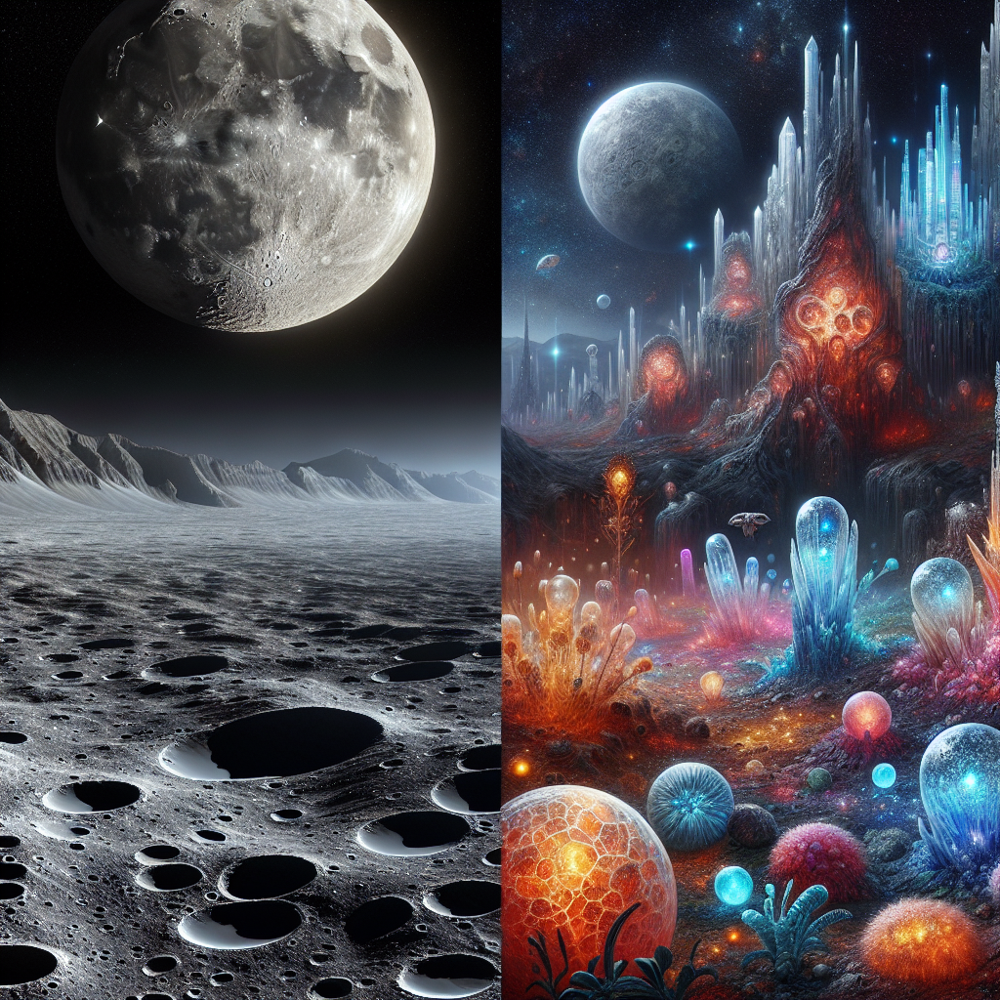
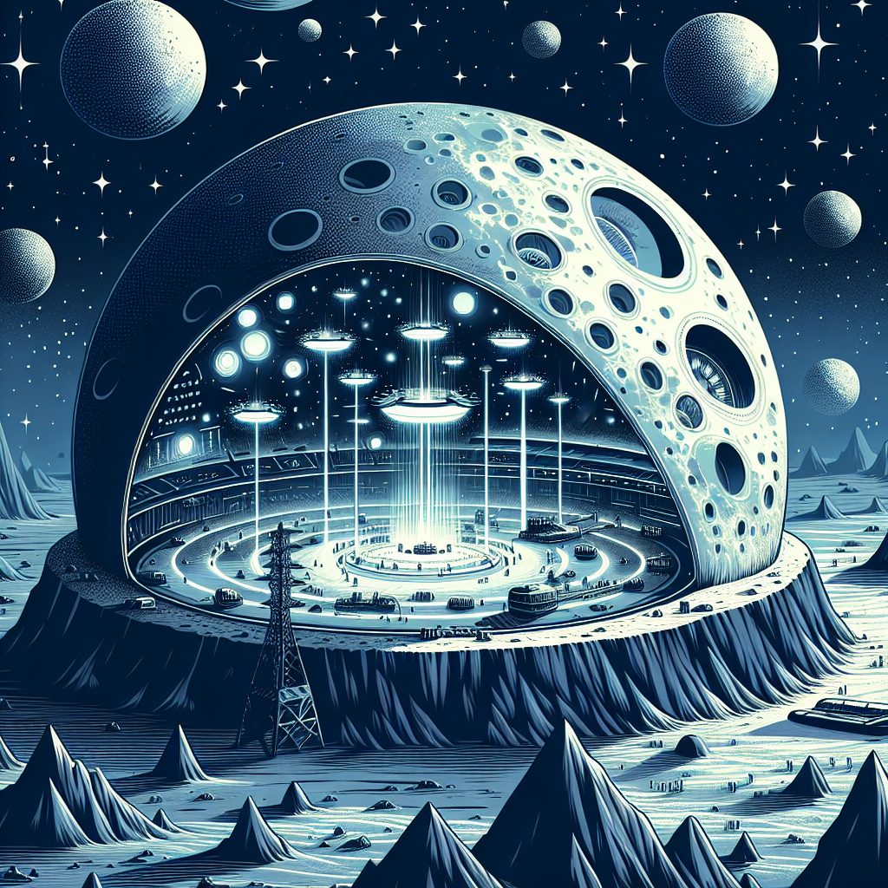
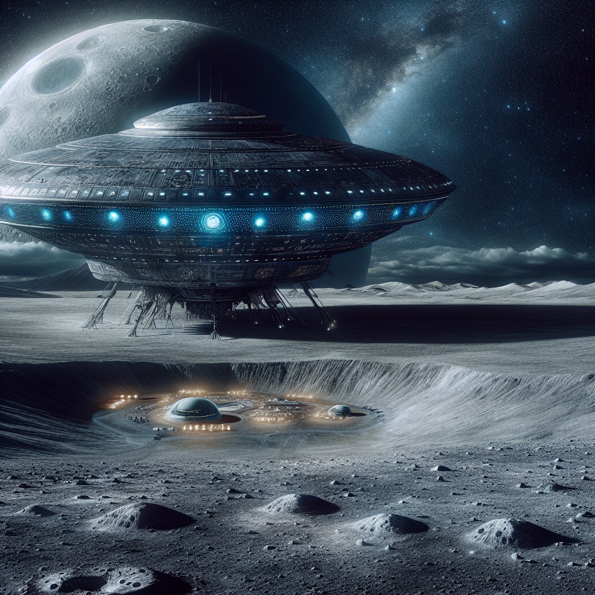

# 🔥 Turing Studio – AI-Powered Video Generation 🔥  
**"From mind to screen—fully AI-generated videos at the speed of thought."**  

Welcome to **Turing Studio**, a project born out of pure curiosity, a love for AI, and a bit of **cyberpunk hacker madness**. This tool takes nothing but **words** and turns them into full-fledged **AI-generated marketing videos, entertainment clips, social media content**, or whatever your **imagination** throws at it.  

💀 **Unfinished? Yep. But fully operational.**  
💡 **Open to collaboration? Absolutely.**  
🕶️ **Free and open-source? Hell yeah.**  

If you're tired of boring manual editing and **want to generate videos from thin air**, this is your **cyberpunk dream machine**.  

---

## ⚙️ **How It Works**  
Turing Studio is a **modular AI-powered video generation system**, composed of multiple APIs and services that work together to **create videos from text prompts**.  

💻 **Enter a description** → 🎨 **Generate images** → 🎞️ **Animate them** → 🎤 **AI voiceover** → 🎼 **Background music** → 🎬 **Final composition**  

Here's what it looks like under the hood:  

### 🛠 **Project Structure**  
```sh
frontend/            # (Not finished, UI planned but still using Postman)
image-gen/           # Generates AI images for video scenes
music-maker/         # AI-generated background music
README.md            # You are here, cyber traveler
text-2-vid/          # Turns images into animated video clips
video-api/           # The main processing API
video-script-api/    # AI scriptwriting, voiceovers, and full video assembly
voice-gen-api/       # AI-generated voiceovers with cloned voices
```

---

## 🎥 **AI-Generated Video Samples**  

🤖 **Here’s a taste of what this beast can create.**  
These samples were **100% generated by AI**, including **script, images, animation, voiceovers, and music**.  

### 🎬 **Final Rendered Videos**  
🔥 Fully AI-generated, no manual editing.  

#### 📺 **Final Videos**  
  
[▶️ Watch Sample 1](video-script-api/samples/final_video.mp4)  

  
[▶️ Watch Sample 2](video-script-api/samples/"final_video (3).mp4")  

#### 🎞 **Generated Frames**  
AI-Generated video frames from different scenes.  

| Scene 1  | Scene 2  | Scene 3  |
|----------|----------|----------|
|  |  |  |

| Scene 4  | Scene 5  | Scene 6  |
|----------|----------|----------|
|  |  |  |

---

## 🏴‍☠️ **Installation & Setup**  

You wanna run this? **Cool.** Here’s how.  

### 1️⃣ **Clone the Repo**  
```bash
git clone <your-repo-url>
cd turing-studio
```

### 2️⃣ **Install Dependencies**  
```bash
npm install
```

### 3️⃣ **Run the Backend API**  
```bash
cd video-script-api
node app.js
```

### 4️⃣ **(Optional) Run the Ollama API for Llama-3 AI Processing**  
```bash
node app_ollama.js
```

### 5️⃣ **Run the AI Services**
Each module runs its own API. You need to start them separately.  

```bash
cd image-gen && node app.js   # Generates images  
cd text-2-vid && node app.js   # Turns images into animations  
cd voice-gen-api && node app.js   # AI-generated voiceovers  
cd music-maker && node app.js   # AI music generation  
```

### 6️⃣ **(Optional) Run the Frontend (When Finished)**
```bash
cd frontend
npm start
```
*(But don’t get your hopes up—this UI is **unfinished and broken**. Use Postman instead.)*

---

## 📡 API Integration (Postman or API Calls)  

### **1️⃣ Generate a Video Script & Assets**  
🔹 **Endpoint:**  
`POST http://localhost:5000/generate-video`  

🔹 **Request Body:**  
```json
{
  "description": "A cyberpunk hacker in a neon-lit cityscape",
  "voiceOverTranscript": "In the digital abyss, we are the architects of reality."
}
```

🔹 **Response:**  
Returns:
- AI-generated **script**
- AI-generated **images**
- AI-generated **voiceover**
- AI-generated **video clips**

### **2️⃣ Combine the Final Video**  
🔹 **Endpoint:**  
`POST http://localhost:5000/combine-video`  

🔹 **Request Body:**  
```json
{
  "videoId": "unique_video_id",
  "musicPrompt": "Dark synthwave cyberpunk soundtrack",
  "platform": "youtube"
}
```

🔹 **Response:**  
- Returns the final **MP4 video**.

---

## 🛑 **Known Issues & Limitations**  
🚧 **Frontend is not working yet** (but you can still generate videos via API).  
🎞 **Image quality varies** (depends on AI model).  
⏳ **Processing times depend on your hardware**.  
💀 **GPU acceleration is recommended**.  

---

## 🔥 **Future Plans (If I Get Motivated or More Hackers Join)**  
- ✅ **Finish the frontend UI** (or at least make it functional).  
- ✅ **Improve motion consistency in animations**.  
- ✅ **Enhance AI voice cloning** for better narration.  
- ✅ **Fine-tune background music generation**.  
- ✅ **Enable longer-form video generation**.  
- ✅ **Expand to different aspect ratios (TikTok, YouTube Shorts, Instagram Reels, etc.)**.  

---

## 🏴 **Join the Crew (Let’s Build This Together!)**  
This was a **side project for fun** that turned into something **pretty damn cool**. But let’s be real—**it’s not finished**.  

🕶️ **Want to contribute? Fork it, clone it, build it.**  
💬 **Want to chat? Let’s set up a Discord or something.**  
🤖 **Want to use this to generate insane AI videos? Go for it.**  

If I see **enough people interested**, I’ll **keep pushing updates** and **make this thing even better**. Otherwise, I’ll just keep using **Postman** like a lazy hacker. 😎  

👨‍💻 **Check out my work at:** [theeseus.dev](https://theeseus.dev)  

---

## 🎭 **License**  
**MIT License** – Use it, modify it, break it, fix it, make it your own.  

---

🔥 **Turing Studio – From text to video in a cyberpunk future.** 🔥  
**Hack the creative process. Generate the impossible.** 🚀  

**Author: Samuel Paniagua**